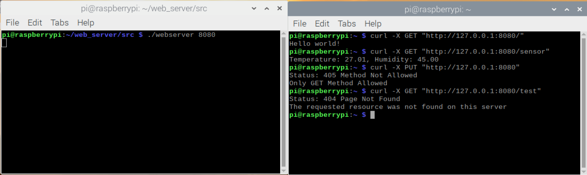

# HTTP Server
This repository contains code for the simple HTTP server with sockets using TCP which listens on 8080 port. The server uses POSIX threads to handle multiple clients at the same time. 
The implementation was done on Raspberry Pi 4 which runs Raspbian OS with interfaced temperature and humidity sensor (DHT11). The server only supports GET operation for accessing root and sensor resource. For unpermitted operations, it returns 405 Status, while for accessing unexisting resources it responds with 404 status. 

# Implementation
Server passively waits for a connection, while the client is the one which initiates the communication.  The web server implementation is based on sockets using functions declared in [<sys/socket.h>](https://pubs.opengroup.org/onlinepubs/007908799/xns/syssocket.h.html). The working principle of server is done in following fashion:
1. `socket()` for creating a new communication endpoint
2. `bind()` to attach a local address to a socket
3. `listen()` to announce willingness to accept connections
4. `accept()` to accept connection
5. `read()` for reading incoming stream
6. `write()` to send data over connection
7. `close()` to release connection

For handling multiple clients, a thread is created per each connection using pthreads [<pthread.h>](https://pubs.opengroup.org/onlinepubs/7908799/xsh/pthread.h.html). To avoid simultaneous accessing from multiple threads to sensor data, synchronization is achieved with the use of mutex.  The connection between RPi and DHT11 is shown below. Sensor readings is achieved with the usage of functions provided by a C library which provides
access to the GPIO [BCM2835](https://www.airspayce.com/mikem/bcm2835/), while sensor datasheet can be found [here](https://www.mouser.com/datasheet/2/758/DHT11-Technical-Data-Sheet-Translated-Version-1143054.pdf).

```
 RPi               DHT11
----------------------------
Pin 7              Data
Pin 14 (GND)       GND
Pin 4 (5V)         Vcc
----------------------------

```

# Usage

Run `$ make` in `src/` directory and start the server with `$./webserver 8080`. The server was tested with curl. To send GET request when the server is running type `$ curl -X GET "http://127.0.0.1:8080/sensor"`. The response from root (`/`) is `Hello world!`, while from the sensor (`/sensor`) is `Temperature: xx.xx, Humidity: xx.xx`.

## Error Status 
Response to client in case of unpermitted operations. 
- `Status: 404 Page Not Found The requested resource was not found on this server`
- `Status: 405 Method Not Allowed Only GET Method Allowed`

## Example

